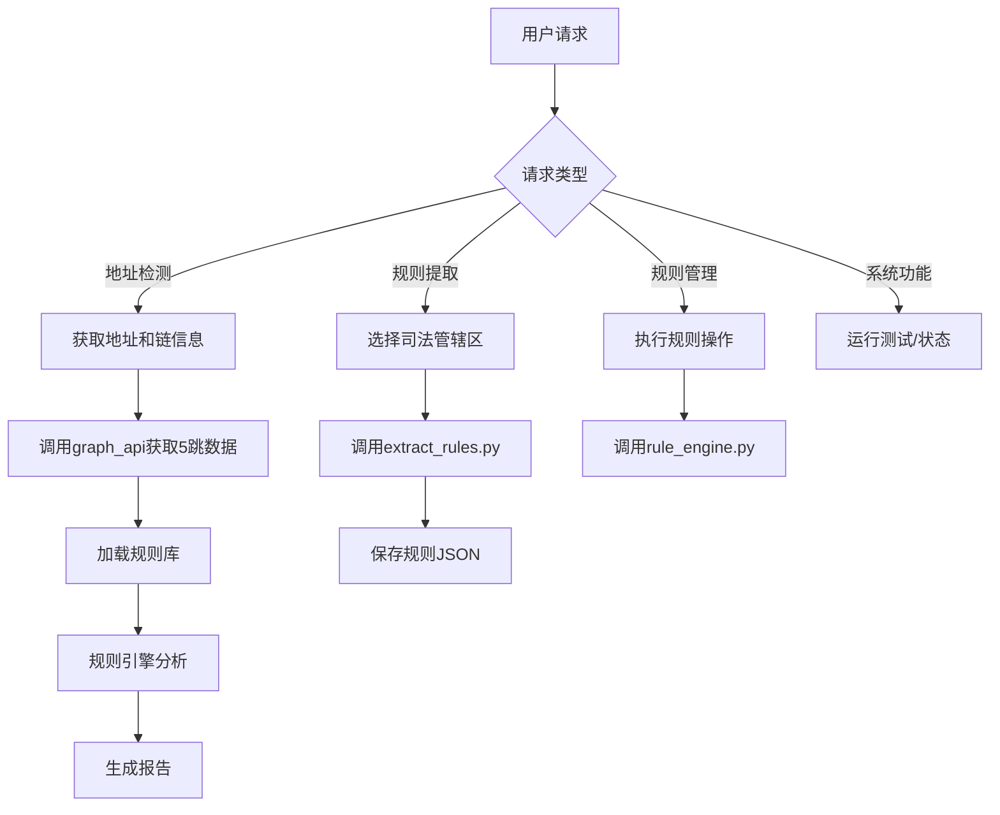

# AML规则引擎技能

本技能提供完整的AML合规检测工作流：**从法规提取规则 → 获取地址交易图谱 → 规则引擎分析 → 生成合规报告**。所有功能通过AI对话调用，无需用户直接运行命令行。

## 快速开始

### 用户请求模式识别

当用户提出以下类型请求时，触发本技能：

1. **检测地址风险** - "检测这个Tron地址的AML风险"、"分析以太坊地址0x...的合规性"
2. **规则提取** - "从新加坡法规提取AML规则"、"更新香港的合规规则库"
3. **批量检测** - "批量检测这些地址"、"检查地址列表文件"
4. **规则管理** - "添加一条自定义规则"、"查看当前所有规则"
5. **系统状态** - "AML技能状态"、"测试规则引擎"

### 核心工作流决策树

根据用户请求，按以下流程执行：



## 任务执行指南

### 任务1: 单地址检测

**用户示例**: "检测Tron地址THaUuZZ6PMHnLong9GTnpNFi6BGo5BaAmt的AML合规性"

**执行步骤**:
1. **确认参数**: 提取链名(Tron)和地址
2. **获取数据**: 运行 `python scripts/graph_api.py --chain Tron --address <address>` 或直接调用 `graph_api.get_address_graph()` 函数
3. **加载规则**: 使用 `rule_engine.load_rules()` 加载 `all_rules.json` 或指定司法管辖区规则
4. **分析检测**: 调用 `rule_engine.analyze_address(graph_data, rules)`
5. **生成报告**: 使用 `demo_cli.print_report()` 格式化输出，或直接返回JSON结果

**关键脚本**:
- `scripts/graph_api.py` - 获取地址交易图谱数据
- `scripts/rule_engine.py` - 规则匹配和分析引擎
- `scripts/demo_cli.py` - 报告生成和用户界面

### 任务2: 从法规提取规则

**用户示例**: "从新加坡MAS法规提取所有AML规则"

**执行步骤**:
1. **确认司法管辖区**: Singapore, HongKong, Dubai 或 all
2. **运行提取**: `python scripts/extract_rules.py --jurisdiction singapore`
3. **保存规则**: 提取结果自动保存为 `singapore_rules.json`，合并到 `all_rules.json`
4. **验证规则**: 使用 `python scripts/extract_rules.py --test` 测试规则解析

**关键脚本**:
- `scripts/extract_rules.py` - 从Markdown法规文件自动提取结构化规则

### 任务3: 批量地址检测

**用户示例**: "批量检测addresses.txt文件中的所有地址"

**执行步骤**:
1. **读取文件**: 解析地址列表文件，每行格式 `链名,地址`
2. **并行处理**: 使用 `demo_cli.batch_analyze()` 或循环调用单地址检测
3. **汇总报告**: 生成批量检测摘要，突出高风险地址

### 任务4: 规则管理

**用户示例**: "添加一条自定义阈值规则"

**执行步骤**:
1. **解析规则JSON**: 用户提供规则JSON或描述
2. **添加到规则库**: 调用 `rule_engine.add_custom_rule(rule_json)`
3. **验证规则**: 运行测试确保规则格式正确

## 资源参考

### scripts/ 目录

可执行脚本，可直接运行或导入调用：

1. **`graph_api.py`** - TrustIn Investigate API集成
   - `get_address_graph(chain, address, hops=5)` - 获取地址5跳内交易图谱
   - 需要环境变量 `TRUSTIN_API_KEY` (默认使用内置测试密钥)

2. **`extract_rules.py`** - 法规规则提取器
   - `extract_singapore_rules()` - 从新加坡法规提取规则
   - `extract_hongkong_rules()` - 从香港法规提取规则
   - `extract_all_rules()` - 提取所有司法管辖区规则

3. **`rule_engine.py`** - 规则匹配引擎
   - `load_rules(json_file)` - 加载规则库
   - `analyze_address(graph_data, rules)` - 分析地址合规性
   - `detect_violations(transactions, rule)` - 检测单个规则违规

4. **`demo_cli.py`** - 用户界面和报告
   - `analyze_address(chain, address, jurisdiction)` - 完整分析流程
   - `print_report(report)` - 格式化输出报告
   - `interactive_mode()` - 交互式命令行界面

5. **`integration_test.py`** - 端到端集成测试
   - `main()` - 运行完整工作流测试

### references/ 目录

法规原文文件，按司法管辖区组织：
- `references/singapore/` - 新加坡MAS法规 (36个文件)
- `references/hongkong/` - 香港SFC法规 (11个文件)  
- `references/dubai/` - 迪拜VARA法规 (待补充)
- `references/fatf/` - FATF国际标准 (9个文件)

**提取规则时自动读取这些文件**，无需手动加载。

### 规则数据库

- `all_rules.json` - 所有提取的规则 (新加坡36条 + 香港11条)
- `test_singapore_rules.json` - 新加坡规则测试样本

## 配置要求

### 环境变量
```bash
export TRUSTIN_API_KEY="ce02a019-722b-48ba-864d-71071c2c0ebd"  # 默认测试密钥
```

### API端点
- **TrustIn Investigate API**: `https://api.trustin.info/api/v2/investigate/`
- **免费额度**: 测试密钥有限制，生产环境需要用户自己的API密钥

## 错误处理

### 常见问题及解决方案

1. **API密钥无效**
   - 检查 `TRUSTIN_API_KEY` 环境变量
   - 使用 `graph_api.py --test` 测试连接

2. **地址格式错误**
   - Tron地址: 以T开头，34字符
   - Ethereum地址: 以0x开头，42字符
   - 提供正确示例

3. **法规文件缺失**
   - 确保 `references/` 目录存在且包含法规文件
   - 使用 `extract_rules.py --list-files` 查看可用文件

4. **规则解析失败**
   - 部分非标准格式法规可能解析失败
   - 记录警告并继续处理其他文件

## 测试与验证

运行完整集成测试确保功能正常：
```bash
python scripts/integration_test.py
```

测试内容包括：
- ✅ API连接测试
- ✅ 规则提取测试  
- ✅ 规则匹配测试
- ✅ 端到端地址检测测试

## 性能提示

1. **缓存机制**: 频繁检测的地址结果可缓存24小时
2. **批量优化**: 批量检测使用异步并行请求
3. **增量更新**: 规则库支持增量更新，避免重复提取
4. **内存管理**: 大型交易图谱数据流式处理，避免内存溢出